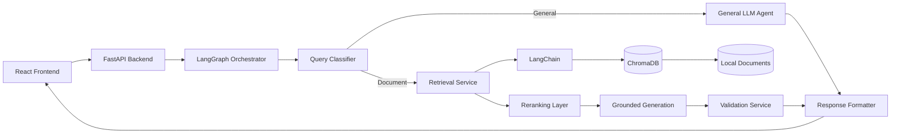
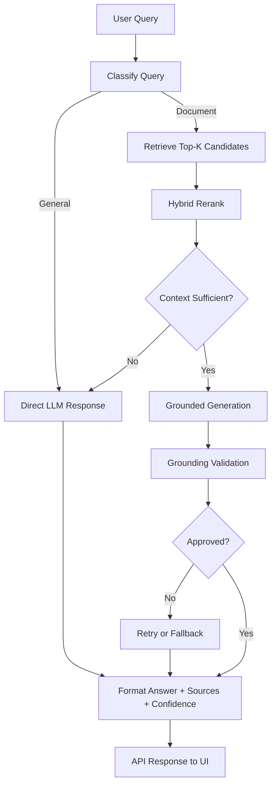

# PrivAI - Secure Enterprise AI Knowledge Assistant

PrivAI is a privacy-first enterprise AI assistant built for secure internal knowledge operations. It combines a hybrid conversational AI layer with Retrieval-Augmented Generation (RAG) so teams can ask both general questions and document-grounded enterprise questions from one interface.

All inference and retrieval run locally using Ollama and local vector storage. Sensitive company data stays inside your environment.

## Key Features

- Document-based Q&A (RAG) over enterprise files
- AI Policy Assistant for HR, security, and internal guidelines
- Employee Helpdesk for operational and process-oriented support
- Document Summarization for long reports and policies
- Contract Analysis for obligations, clauses, risks, and terms
- Meeting Intelligence for transcript summaries and action items
- Knowledge Search with cited evidence and confidence scoring
- Local LLM support via Ollama (Llama3 + local embeddings)

## System Architecture

High-level pipeline:

Frontend -> FastAPI -> LangGraph -> LangChain -> ChromaDB -> Local LLM -> Documents

Runtime behavior:

- General conversational queries are routed directly to the local LLM
- Document-based queries are routed through RAG retrieval + validation

### Architecture Diagram



### Workflow Diagram



## Tech Stack

- FastAPI
- LangChain
- LangGraph
- ChromaDB
- Ollama (Llama3)
- React + TypeScript + Tailwind CSS

Additional production/evaluation tooling:

- Structured logging with rotating files
- Evaluation pipeline with scikit-learn + matplotlib

## Project Structure

```text
PrivAI-Secure-Enterprise-AI-Assistant/
|- app/                    # Backend (FastAPI)
|  |- core/                # Settings, model clients, infra config
|  |- schemas/             # Pydantic request/response models
|  |- services/            # Agents, retrieval, indexing, formatting, graph logic
|  |- main.py              # API routes and orchestration entry
|
|- frontend/               # Frontend (React + TypeScript + Tailwind + Vite)
|  |- src/
|     |- pages/            # Chat, Search, Upload, Summarize, Analyze, Meeting views
|     |- services/         # API client layer
|     |- components/       # Shared UI/markdown rendering
|
|- data/                   # Local runtime data
|  |- docs/                # Source documents for ingestion
|  |- chroma/              # ChromaDB persisted vector index
|
|- scripts/                # Utility scripts (for example smoke tests)
|  |- evaluate_system.py   # Accuracy/precision/recall/F1/latency evaluation
|- requirements.txt        # Backend dependencies
|- README.md
```

Note:

- Backend domain services live under app/services/
- Workflow orchestration logic is implemented in app/services/graph_service.py

## How It Works (Flow)

1. User submits a query from the UI
2. Query classification decides route:
   - General query -> direct LLM response
   - Document query -> RAG pipeline
3. Document route performs retrieval from ChromaDB
4. Retrieved context is analyzed for sufficiency
5. Response is generated (strictly grounded for document route)
6. Validation agent checks grounding and confidence
7. Formatter produces structured output for frontend rendering
8. User receives response with answer, confidence, validation status, and sources

### Hybrid Logic Summary

- General queries (hello, hi, conversational prompts) bypass retrieval and are answered directly by the local LLM.
- Document queries (policy, contracts, compliance, meeting intelligence) use retrieval + reranking + strict grounding.
- If retrieval is weak/empty for chat/search, the workflow falls back to general response mode.

## Installation and Setup

### 1. Clone repository

```bash
git clone <repository-url>
cd PrivAI-Secure-Enterprise-AI-Assistant
```

### 2. Backend setup

```bash
python3.11 -m venv venv
source venv/bin/activate
python -m pip install -r requirements.txt
cp .env.example .env
```

Run backend:

```bash
uvicorn app.main:app --reload --port 8000
```

### 3. Install and run Ollama

Install Ollama from https://ollama.com, then pull required models:

```bash
ollama pull llama3
ollama pull nomic-embed-text
```

Ensure Ollama is running before using the app.

### 4. Frontend setup

In a new terminal:

```bash
cd frontend
npm install
cp .env.example .env
npm run dev
```

Frontend URL: http://localhost:5173

Backend URL: http://localhost:8000

### 5. Optional API smoke test

```bash
source venv/bin/activate
python scripts/api_smoke_test.py --base-url http://127.0.0.1:8000
```

### 6. Optional evaluation run (academic metrics)

```bash
source venv/bin/activate
python scripts/evaluate_system.py \
   --base-url http://127.0.0.1:8000 \
   --dataset data/eval/sample_eval.jsonl \
   --output-dir reports/evaluation
```

Generated artifacts:

- `reports/evaluation/metrics.json`
- `reports/evaluation/detailed_results.json`
- `reports/evaluation/confusion_matrix.png`
- `reports/evaluation/response_times.png`
- `reports/evaluation/metrics_bar_chart.png`

## Usage

1. Upload enterprise documents in the upload mode (txt/pdf)
2. Trigger indexing or reindex if needed
3. Use chat/search for knowledge queries
4. Use summarize mode for concise document summaries
5. Use analyze mode for contract/policy extraction
6. Use meeting mode for transcript intelligence
7. Use `/diagnostics` endpoint for system diagnostics and runtime telemetry

## Example Queries

- What is the leave policy?
- Summarize this document
- Analyze this contract
- hello

Expected behavior:

- hello -> conversational assistant response (general route)
- leave/contract/policy queries -> document-grounded RAG response with citations

## Known Issues and Fixes

1. Vector DB reset issue

- Symptom: indexing errors due to stale/corrupt persisted Chroma state
- Fix: reset data/chroma and reindex documents

2. Ollama connection requirement

- Symptom: model calls fail or health endpoint is degraded
- Fix: start Ollama and ensure llama3 + nomic-embed-text are available

3. Missing document indexing

- Symptom: no grounded answers or empty retrieval context
- Fix: upload documents and run indexing/reindex endpoint

4. Port conflict on backend startup

- Symptom: uvicorn fails to bind to port 8000
- Fix: stop old process and restart (for example, `lsof -ti:8000 | xargs kill -9`)

5. Virtual environment pip launcher mismatch

- Symptom: `venv/bin/pip` points to stale interpreter after venv rename
- Fix: use `venv/bin/python -m pip install -r requirements.txt`

## Production Features Implemented

- Corruption-safe Chroma initialization with automatic reset/rebuild fallback
- Incremental indexing and deterministic chunk metadata
- Hybrid query routing (general vs RAG)
- Retrieval reranking (vector + lexical blend)
- Validation + confidence scoring with retry/fallback logic
- Structured markdown output formatting with deduplicated sources
- Health and diagnostics endpoints (`/health`, `/diagnostics`)
- Rotating file logging and runtime request telemetry

## Future Improvements

- Advanced semantic reranking with dedicated cross-encoder model
- Streaming responses for lower perceived latency
- Authentication and enterprise SSO integration
- Role-based access control for documents and actions
- Real human approval workflow with reviewer UI and audit trail

## Screenshots

Add UI screenshots here:

- Dashboard overview
- Chat with citations
- Summarization output
- Contract analysis output

## License

This project is licensed under the MIT License.